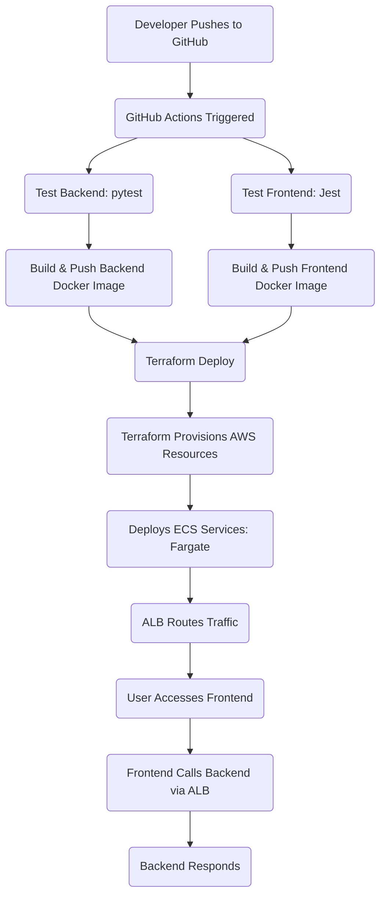
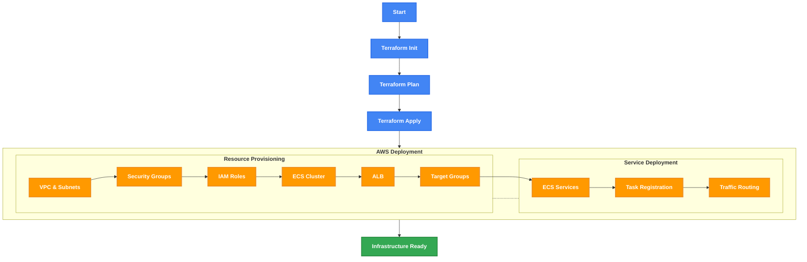

# 🚀 StackOps: DevOps Assignment

Welcome to **StackOps** – a modern, production-ready DevOps project that demonstrates a complete CI/CD pipeline using **GitHub Actions**, **Terraform**, **AWS ECS/Fargate**, **Application Load Balancer (ALB)**, and robust application stacks with **FastAPI** (backend) and **Next.js** (frontend). Everything is containerized with Docker and tested end-to-end!

---

## video link: 
https://drive.google.com/drive/folders/1FZyL5bFB7qckb-N7UZk2AR6lAVot9a7w?usp=sharing

## images:
all the images have been added to drive and the image folder in the repo.

## 🗂️ Project Structure

```
.
├── backend/               # FastAPI backend (Dockerized, tested)
│   ├── app/
│   │   └── main.py
│   └── requirements.txt
├── frontend/              # Next.js frontend (Dockerized, tested)
│   ├── pages/
│   │   └── index.js
│   ├── public/
│   └── package.json
├── terraform/             # Infrastructure as Code (AWS resources)
│   ├── main.tf
│   ├── alb.tf
│   ├── iam.tf
│   ├── frontend.tf
│   ├── backend.tf
│   └── ...
└── .github/workflows/
    └── ci-cd.yml          # GitHub Actions CI/CD pipeline
```

---


## 🔄 CI/CD & Deployment Flow (Mermaid Diagram)




---

## 🗂️ Terraform implementation on AWS




## 🌐 Solution Overview

- **Infrastructure**: Provisioned with Terraform (ALB, ECS Cluster, IAM, Networking)
- **CI/CD**: Automated with GitHub Actions (test, build, push, deploy)
- **Backend**: FastAPI (Python), containerized, tested
- **Frontend**: Next.js (React), containerized, tested
- **Deployment**: Docker images pushed to Docker Hub, deployed to AWS ECS Fargate behind an ALB

---

## 🛠️ How It Works

### 1. **Infrastructure as Code (Terraform)**
- **IAM Roles**: Secure ECS task execution with least-privilege roles.
- **ALB**: Routes traffic to frontend (port 3000) and backend (port 8000) services.
- **ECS Fargate**: Runs Docker containers for both frontend and backend.
- **Networking**: VPC, subnets, and security groups for secure, scalable deployment.

### 2. **CI/CD Pipeline (GitHub Actions)**
- **On every push/PR to `main`:**
  - **Checkout**: Fetch code and commit SHA.
  - **Test Backend**: Install Python deps, run FastAPI tests.
  - **Test Frontend**: Install Node deps, run Next.js/Jest tests.
  - **Build & Push Images**: Docker build & push for both frontend and backend to Docker Hub.
  - **Terraform Deploy**: Provision/update AWS infrastructure and deploy latest images.

### 3. **Application**
- **Frontend**: Next.js app connects to backend via environment variable (`NEXT_PUBLIC_API_URL`), displays backend health and message.
- **Backend**: FastAPI exposes `/api/health` and `/api/message` endpoints.

---


## 🚦 Quick Start

### 1. **Clone & Setup**

```sh
git clone https://github.com/{your_repo}.git
cd stackOps
```

### 2. **Local Development**

#### Backend

```sh
cd backend
python -m venv venv
source venv/bin/activate
pip install -r requirements.txt
uvicorn app.main:app --reload --port 8000
```

#### Frontend

```sh
cd frontend
npm install
echo "NEXT_PUBLIC_API_URL=http://localhost:8000" > .env.local
npm run dev
```

### 3. **Run Tests**

#### Backend

```sh
cd backend
pytest
```

#### Frontend

```sh
cd frontend
npm test
```

### 4. **Build Docker Images**

```sh
# Backend
cd backend
docker build -t {your_dockerhub}/stackops-backend:latest .

# Frontend
cd frontend
docker build -t {your_dockerhub}/stackops-frontend:latest .
```

---

## 🚢 Production Deployment

1. **Push to `main` branch**  
   GitHub Actions will:
   - Run all tests
   - Build & push Docker images
   - Deploy infrastructure and services to AWS via Terraform

2. **Access the Application**  
   - Find the ALB DNS name in AWS Console or Terraform output.
   - Visit `http://<alb-dns-name>` for the frontend.
   - API endpoints are available at `http://<alb-dns-name>/api/health` and `/api/message`.

---

## 🔒 Security & Best Practices

- **IAM roles**: Principle of least privilege for ECS tasks.
- **Secrets**: DockerHub and AWS credentials managed via GitHub Secrets.
- **Testing**: Automated for both frontend and backend.
- **Infrastructure**: Versioned and reproducible with Terraform.

---

## 📋 API Endpoints

- `GET /api/health`  
  Returns:  
  ```json
  { "status": "healthy", "message": "Backend is running successfully" }
  ```

- `GET /api/message`  
  Returns:  
  ```json
  { "message": "You've successfully integrated the backend!" }
  ```

---

## 💡 Customization

- **Change Backend URL**:  
  Edit `frontend/.env.local` and set `NEXT_PUBLIC_API_URL` to your backend endpoint.

- **Scale Services**:  
  Adjust `desired_count` in Terraform ECS service definitions.

---

## 🤝 Contributing

PRs and issues welcome! Please ensure all tests pass and follow the existing code style.

---

## 📜 License

MIT

---

**Happy DevOps-ing! 🚀**

```
Replace the following:
- `{your_repo}`: Your GitHub repository URL
- `{your_dockerhub}`: Your Docker Hub username
```
